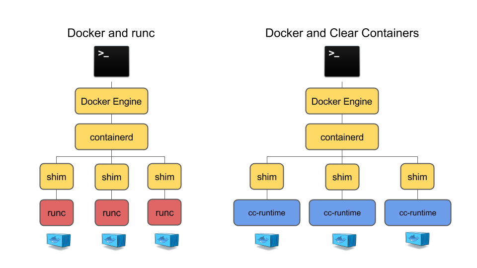
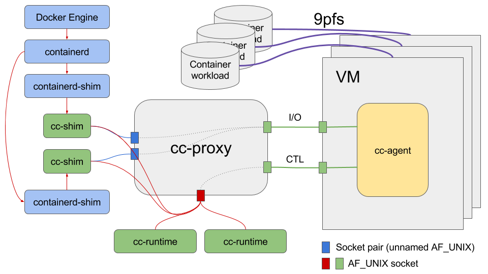
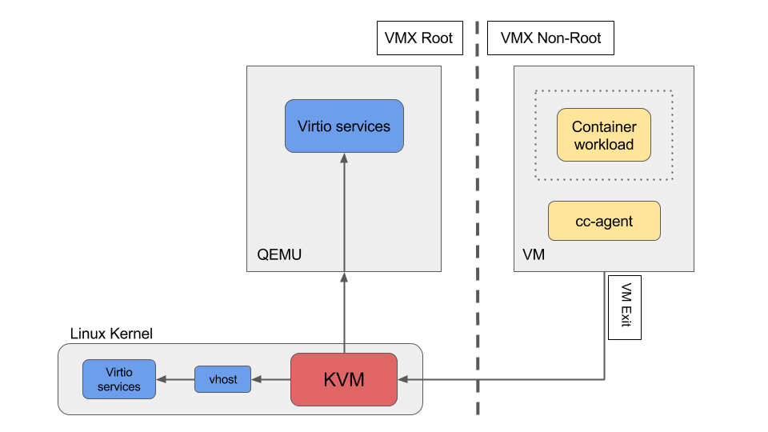
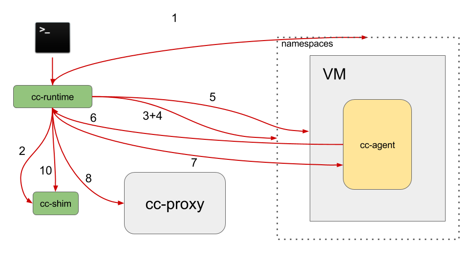
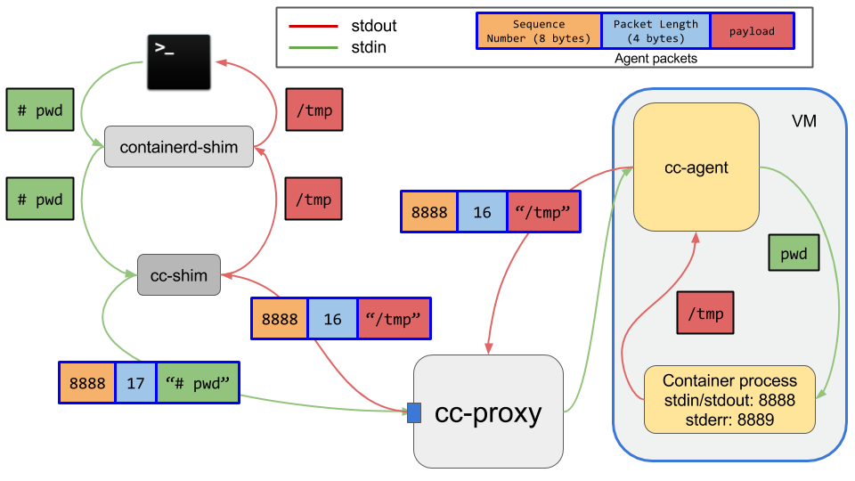
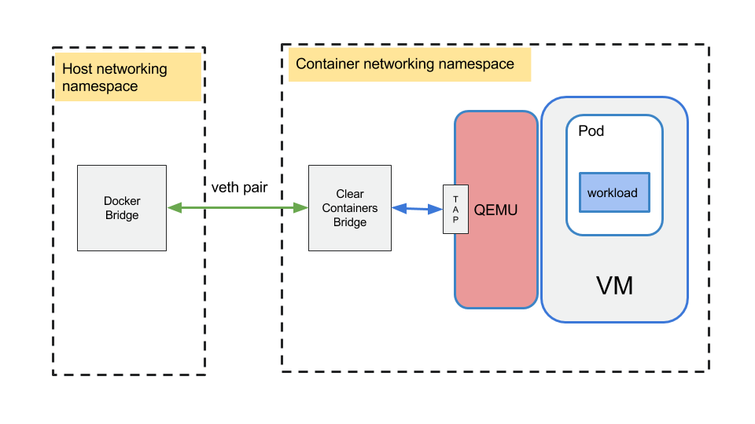

# Clear Containers Architecture

## TODO:
```
-discussion around configuration.toml?
-do we need/want a more thorough description of virtcontainers?
-replace the create process png with a UML flow instead (and remove from proxy section)?
-cleanup of agent section
-add crio/conmon/k8s details
```

* [Overview](#overview)
    * [Hypervisor](#hypervisor)
    * [Agent](#agent)
    * [Runtime](#runtime)
        * [create](#create)
        * [start](#start)
        * [exec](#exec)
        * [kill](#kill)
        * [delete](#delete)
    * [Proxy](#proxy)
    * [Shim](#shim)
    * [Networking](#networking)
    * [Storage](#storage)
* [Appendices](#appendices)
    * [DAX](#dax)
    * [Previous Releases](#previous-releases)

## Overview

This is an architectural overview of Clear Containers, based on the 3.0 release.

The [Clear Containers runtime (cc-runtime)](https://github.com/clearcontainers/runtime)
is compatible with the [OCI](https://github.com/opencontainers) specifications
and thus works seamlessly with the
[Docker Engine](https://www.docker.com/products/docker-engine) pluggable runtime
architecture or the [Kubernetes Container Runtime Interface (CRI)](https://github.com/kubernetes/kubernetes/tree/master/pkg/kubelet/apis/cri/v1alpha1/runtime) through the [CRI-O](https://github.com/kubernetes-incubator/cri-o) implementation. In other words, one can transparently select between the
[default Docker and CRI-O runtime (runc)](https://github.com/opencontainers/runc) and
`cc-runtime`.




`cc-runtime` creates a QEMU/KVM virtual machine for each container the Docker
engine creates. <-- we probably don't need to make this docker specific here?

The container process is then spawned by an
[agent](https://github.com/clearcontainers/agent) running as a daemon inside
the virtual machine. The agent opens two virtio serial interfaces (Control and
I/O) in the guest, and QEMU exposes them as serial devices on the host. `cc-runtime`
uses the control device for sending container management commands to the agent
while the I/O serial device is used to pass I/O streams (`stdout`, `stderr`,
`stdin`) between the guest and the Docker Engine.

For any given container, both the init process and all potentially executed
commands within that container, together with their related I/O streams, need
to go through two virtio serial interfaces exported by QEMU. The [Clear Containers
proxy (`cc-proxy`)](https://github.com/clearcontainers/proxy) multiplexes and
demultiplexes those commands and streams for all container virtual machines.
There is only one `cc-proxy` instance running per Clear Containers host.

On the host, each container process's removal is handled by a reaper in the higher
layers of the container stack. In the case of Docker it is handled by `containerd-shim`.
In the case of CRI-O it is handled by `conmon`.  For clarity, we will call this
the `container process reaper`. As Clear Containers processes run inside their
own  virtual machines, the `container process reaper` can not monitor, control
or reap them. `cc-runtime` fixes that issue by creating an [additional shim process
(`cc-shim`)](https://github.com/clearcontainers/shim) between `containerd-shim` or `conmon`
and `cc-proxy`. A `cc-shim` instance will both forward signals and `stdin` streams
to the container process on the guest and pass the container `stdout` and `stderr`
streams back up the stack to CRI-O or Docker via the `container process reaper`.
`cc-runtime` creates a `cc-shim` daemon for each container and for each OCI command
received to run within an already running container (i.e. `docker exec`).

The container workload, i.e. the actual OCI bundle rootfs, is exported from the
host to the virtual machine.  In the case where a block-based graph driver is
configured, virtio-blk will be used. In all other cases a 9pfs virtio mount point
will be used. `cc-agent` uses this mount point as the root filesystem for the
container processes.



## Hypervisor

Clear Containers use  [QEMU](http://www.qemu-project.org/)/[KVM](http://www.linux-kvm.org/page/Main_Page)
to create virtual machines where containers will run:



Although Clear Containers can run with any recent QEMU release, containers boot
time and memory footprint are significantly optimized by using a specific QEMU
version called [`qemu-lite`](https://github.com/01org/qemu-lite/tree/qemu-2.7-lite).

Clear Containers supports various machine types, including `pc`, `pc-lite` and `q35`.
Clear Containers defaults to using the `pc` machine type. In the past
`pc-lite` was utilized which provided the following improvements:
- Removing many of the legacy hardware devices support so that the guest kernel
does not waste time initializing devices of no use for containers.
- Skipping the guest BIOS/firmware and jumping straight to the Clear Containers
kernel.

In order to provide some advanced features which were lacking in `pc-lite` like hotplug
support we moved from to `pc`.

In the future Clear Containers plan to move to v2.9 version of qemu,
available at our Clear Containers [QEMU repo](https://github.com/clearcontainers/qemu/tree/qemu-lite-v2.9.0).
This transition has been delayed to post Clear Containers 3.0 release since there
were regressions introduced, as described in
[runtime issue 407](https://github.com/clearcontainers/runtime/issues/407).  Once support for
features like hotplug are available in `Q35`, the project will look to transition to this
machine type.
 
## Agent

['agent'](https://github.com/clearcontainers/agent) is a daemon running in the
guest as a supervisor for managing containers and processes potentially running
within those containers.

The `agent` execution unit is the pod. An `agent` pod is a container sandbox defined
by a set of namespaces (UTS, PID, mount and IPC). Although a pod can hold several
containers, `cc-runtime` always runs a single container per pod. **fixme** incorrect<--

todo: add details on the agent protocol
todo: detail how agent is based on [runc library libcontainers](https://github.com/opencontainers/runc).

## Runtime

`cc-runtime` is an OCI compatible container runtime and is responsible for handling
all commands specified by
[the OCI runtime specification](https://github.com/opencontainers/runtime-spec)
and launching `cc-shim` instances.

`cc-runtime` heavily utilizes the
[virtcontainers project](https://github.com/containers/virtcontainers), which
provides a generic runtime-specification agnostic hardware-virtualized containers
library.

Here we will describe how `cc-runtime` handles the most important OCI commands.

### [`create`](https://github.com/clearcontainers/runtime/blob/master/create.go)

When handling the OCI `create` command, `cc-runtime` goes through the following steps:

1. Create the container namespaces according to the container OCI configuration
file (only the network and mount namespaces are currently supported).
2. Create the virtual machine running the container process. The VM `systemd` instance will spawn the `agent` daemon.
3. Register the virtual machine with `cc-proxy`.
4. The `cc-proxy` waits for the agent to signal that it is ready and then returns
a token which is unique to this registration.
5. Spawn the `cc-shim` process providing two arguments:
  `cc-shim --token $(token) --uri $(uri)
   * The proxy URL
   * The token for the container process it needs to monitor

--- WIP:
x. Run all the [OCI hooks](https://github.com/opencontainers/runtime-spec/blob/master/config.md#hooks) in the container namespaces,
as described by the OCI container configuration file.

x. [Set up the container networking](#networking)
This must happen after all hooks are done as one of them is potentially setting
the container networking namespace up.




At this point, the container sandbox is created in the virtual machine. The
container process itself is not yet running as one needs to call `docker start`
to actually start it.

### [`start`](https://github.com/clearcontainers/runtime/blob/master/start.go)

With namespace containers `start` launches a traditional Linux container process
in its own set of namespaces. With Clear Containers, the main task of `cc-runtime`
is to create and start a container within the pod that was created during the
`create` step. In practice, this means `cc-runtime` follows these steps:

1. `cc-runtime` connects to `cc-proxy` and sends it the `attach` command to
let it know which pod we want to use to create and start the new container.
2. `cc-runtime` sends an agent `STARTPOD` command via `cc-proxy`.
3. `cc-runtime` sends an agent `NEWCONTAINER` command to create and start a new
container in a given pod. The command is sent to `cc-proxy` who forwards it to
the right agent instance running in the appropriate guest.
a signal and I/O streams proxy between `containerd-shim` and `cc-proxy`.

### [`exec`](https://github.com/clearcontainers/runtime/blob/master/exec.go)

`docker exec` allows one to run an additional command within an already running
container. With Clear Containers, this translates into sending a `EXECCMD` command
to the agent so that it runs a command into a running container belonging to a
certain pod. All I/O streams from the executed command will be passed back to
`containerd` or `conmon` through a newly created `cc-shim`.

The `exec` code path is partly similar to the `create` one and `cc-runtime`
goes through the following steps:

1. `cc-runtime` connects to `cc-proxy` and sends it the `attach` command to let
it know which pod we want to use to run the `exec` command.
2. `cc-runtime` receives a token from `cc-proxy` based on this connection.
3. `cc-runtime` sends an agent `EXECMD` command to start the command in the
right container. The command is sent to `cc-proxy` who forwards it to the right
agent instance running in the appropriate guest.
4. Spawn the `cc-shim` process providing two arguments:
  `cc-shim --token $(token) --uri $(uri)
   * The proxy URL
   * The token provided by the proxy.
The `cc-shim` process will forward the output streams (stderr and stdout) to
either containerd or conmon

Now the `exec`'ed process is running in the virtual machine, sharing the UTS,
PID, mount and IPC namespaces with the container's init process.

### [`kill`](https://github.com/clearcontainers/runtime/blob/master/kill.go)

When sending the OCI `kill` command, container runtimes should send a [UNIX signal](https://en.wikipedia.org/wiki/Unix_signal)
to the container process.
In the Clear Containers context, this means `cc-runtime` needs a way to send a
signal to the container process within the virtual machine. As `cc-shim` is responsible
for forwarding signals to its associated running containers, `cc-runtime` naturally
calls `kill` on the `cc-shim` PID.

However, `cc-shim` is not able to trap `SIGKILL` and `SIGSTOP` and thus `cc-runtime`
needs to follow a different code path for those 2 signals.
Instead of `kill`'ing the `cc-shim` PID, it will go through the following steps:

1. `cc-runtime` connects to `cc-proxy` and sends it the `attach` command to let
it know on which pod the container it is trying to `kill` is running.
2. `cc-runtime` sends an agent `KILLCONTAINER` command to `kill` the container
running on the guest. The command is sent to `cc-proxy` who forwards it to the
right agent instance running in the appropriate guest.

### [`delete`](https://github.com/clearcontainers/runtime/blob/master/delete.go)

`docker delete` is about deleting all resources held by a stopped/killed container.
Running containers can not be `delete`d unless the OCI runtime is explictly being
asked to. In that case it will first `kill` the container and only then `delete`
it.

The resources held by a Clear Container are quite different from the ones held
by a host namespace container e.g. run by `runc`. `cc-runtime` needs mostly to
delete the pod holding the stopped container on the virtual machine, shut the
hypervisor down and finally delete all related proxy resources:

1. `cc-runtime` connects to `cc-proxy` and sends it the `attach` command to let
it know on which pod the container it is trying to to `delete` is running.
2. `cc-runtime` sends an agent `DESTROYPOD` command to `destroy` the pod holding
the container running on the guest. The command is sent to `cc-proxy` who forwards
it to the right agent instance running in the appropriate guest.
3. After deleting the last running pod, the `agent` will gracefully shut the
virtual machine down.
4. `cc-runtime` sends the `UnregisterVM` command to `cc-proxy`, to let it know
that a given virtual machine is shut down. `cc-proxy` will then clean all its
internal resources associated with this VM.

## Proxy

`cc-proxy` is a daemon offering access to the VM [`agent`](https://github.com/clearcontainers/agent)
to multiple `cc-shim` and `cc-runtime` clients.
Only a single instance of `cc-proxy` per host is necessary as it can be used for several different VMs.
Its main role is to:
- Arbitrate access to the `agent` control channel between all the `cc-runtime` instances and the `cc-shim` ones.
- Route the I/O streams between the various `cc-shim` instances and the `agent`.

`cc-proxy` provides 2 client interfaces:

- A UNIX, named socket for all `cc-runtime` instances on the host to send commands to `cc-proxy`.
- One socket pair per `cc-shim` instance, to send stdin and receive stdout and stderr I/O streams. See the
[cc-shim section](#shim)
for more details about that interface.

The protocol on the `cc-proxy` UNIX named socket supports the following commands:
- `RegisterVM`: Used first after connecting to the proxy socket. It is used to let the proxy know about a new container on the system along with the paths go agent's command and I/O channels (AF_UNIX sockets).
- `AttachVM`: It can be used to associate clients to an already known VM.
- `UnregisterVM`: payload does the opposite of what `RegisterVM` does, indicating to the proxy it should release resources created by `RegisterVM`
- `Hyper` : This payload will forward an hyperstart command to agent.
- `ConnectShim`: Used to identify a shim against the proxy.
- `DisconnectShim`: This pay load will unregister a shim from the proxy.

For more details about `cc-proxy`'s protocol, theory of operations or debugging tips, please read
[`cc-proxy` README](https://github.com/clearcontainers/proxy) or the [proxy api `godoc`](https://godoc.org/github.com/clearcontainers/proxy/api).

### Proxy protocol diagram sequence


## Shim

A `container process reaper` such as Docker's `containerd-shim` or crio's `conmon` is designed around the assumption that it can monitor and reap the actual
container process. As `container process reaper` runs on the host, it can not directly monitor a process running
within a virtual machine. At most it can see the QEMU process, but that is not enough.
With Clear Containers, `cc-shim` acts as the container process that `container process reaper` can monitor. Therefore
`cc-shim` needs to handle all container I/O streams (`stdout`, `stdin` and `stderr`) and forward all signals
`container process reaper` decides to send to the container process.

`cc-shim` has an implicit knowledge about which VM agent will handle those streams and signals and thus act as
an encapsulation layer between `container process reaper` and the `agent`:

- It connects to `cc-proxy` using a token with `cc-proxy` `ConnectShim` command . The token is passed from `cc-runtime` to `cc-shim` when the former spawns the latter and is used to identify the container process that the shim will be shadowing.
- It fragments and encapsulates the standard input stream from `container process reaper` into `cc-proxy` stream frames:
```
                     1 1 1 1 1 1 1 1 1 2 2 2 2 2 2 2 2 2 2 3 3
0 1 2 3 4 5 7 8 9 0 1 2 3 4 5 6 7 8 9 0 1 2 3 4 5 6 7 8 9 0 1
┌───────────────────────────┬───────────────┬───────────────┐
│          Version          │ Header Length │   Reserved    │
├───────────────────────────┼─────┬─┬───────┼───────────────┤
│          Reserved         │ Res.│E│  0x2  │    Opcode     │
├───────────────────────────┴─────┴─┴───────┴───────────────┤
│                      Payload Length                       │
├───────────────────────────────────────────────────────────┤
│                                                           │
│                         Payload                           │
│                                                           │
│      (variable length, optional and opcode-specific)      │
│                                                           │
└───────────────────────────────────────────────────────────┘
```
- It de-encapsulates and assembles standard output and error `cc-proxy` stream frames
into an output stream that it forwards to `container process reaper`
- It translates all UNIX signals (except `SIGKILL` and `SIGSTOP`) into `cc-proxy`
`Signal` frames that it sends to the container via `cc-proxy`.

As an example, let's say that running the `pwd` command from a container standard
input will generate `/tmp` from the container standard output. The `agent` assigned
this specific process 8888 and 8889 respectively as the stdin, stdout and stderr
sequence numbers. With `cc-shim` and Clear Containers, this example would look like:



## Networking

Containers will typically live in their own, possibly shared, networking namespace.
At some point in a container lifecycle, container engines will set up that namespace
to add the container to a network which is isolated from the host network, but
which is shared between containers

In order to do so, container engines will usually add one end of a `virtual ethernet
(veth)` pair into the container networking namespace. The other end of the `veth` pair
is added to the container network.

This is a very namespace-centric approach as QEMU can not handle `veth` interfaces.
Instead it typically creates `TAP` interfaces for adding connectivity to a virtual
machine.

To overcome that incompatibility between typical container engines expectations
and virtual machines, `cc-runtime` networking transparently bridges `veth`
interfaces with `TAP` ones:



Clear Containers supports both
[CNM](https://github.com/docker/libnetwork/blob/master/docs/design.md#the-container-network-model)
and [CNI](https://github.com/containernetworking/cni) for networking management.

### CNM


__CNM lifecycle__

1.  RequestPool

2.  CreateNetwork

3.  RequestAddress

4.  CreateEndPoint

5.  CreateContainer

6.  Create config.json

7.  Create PID and network namespace

8.  ProcessExternalKey

9.  JoinEndPoint

10. LaunchContainer

11. Launch

12. Run container


__Runtime network setup with CNM__

1. Read config.json

2. Create the network namespace

3. Call the prestart hook (from inside the netns)

4. Scan network interfaces inside netns and get the name of the interface
created by prestart hook

5. Create bridge, TAP, and link all together with network interface previously
created

### CNI


__Runtime network setup with CNI__

1. Create the network namespace

2. Get CNI plugin information

3. Start the plugin (providing previously created netns) to add a network
described into /etc/cni/net.d/ directory. At that time, the CNI plugin will
create the cni0 network interface and a veth pair between the host and the created
netns. It links cni0 to the veth pair before to exit.

4. Create bridge, TAP, and link all together with network interface previously
created

5. Start VM inside the netns and start the container

## Storage
Container workloads are shared with the virtualized environment through 9pfs.
The devicemapper storage driver is a special case. The driver uses dedicated
block devices rather than formatted filesystems, and operates at the block level
rather than the file level. This knowledge has been used to directly use the
underlying block device instead of the overlay file system for the container
root file system. The block device maps to the top read-write layer for the overlay.
This approach gives much better I/O performance compared to using 9pfs to share
the container file system.

The approach above does introduce a limitation in terms of dynamic file copy
in/out of the container via `docker cp` operations. The copy operation from
host to container accesses the mounted file system on the host side. This is
not expected to work and may lead to inconsistencies as the block device will
be simultaneously written to, from two different mounts. The copy operation from
container to host will work, provided the user calls `sync(1)` from within the
container prior to the copy to make sure any outstanding cached data is written
to the block device.

```
docker cp [OPTIONS] CONTAINER:SRC_PATH HOST:DEST_PATH
docker cp [OPTIONS] HOST:SRC_PATH CONTAINER:DEST_PATH
```

Clear Containers has the ability to hotplug block devices, which makes it
possible to use block devices for containers started after the VM has been launched.

Users can check to see if the container uses devicemapper block device as its
rootfs by calling `mount(8)` within the counter.  If devicemapper block device
is used, '/' will be mounted on `/dev/vda`.

# Appendices

## DAX

Clear Containers utilises the Linux kernel DAX (Direct Access filesystem)
feature to efficiently map some host side files into the guest VM space.
In particular, Clear Containers uses the `QEMU` nvdimm feature to provide a
memory mapped virtual device that can be used to DAX map the mini-OS root
filesystem into the guest space.

Mapping files using DAX provides a number of benefits over more traditional VM
file and device mapping mechanisms:

- Mapping as a direct access devices allows the guest to directly access
the host memory pages (such as via eXicute In Place (XIP)), bypassing the guest
page cache. This provides both time and space optimisations.
- Mapping as a direct access device inside the VM allows pages from the
host to be demand loaded using page faults, rather than having to make requests
via a virtualised device (causing expensive VM exits/hypercalls), thus providing
a speed optimisation.
- Utilising MAP_SHARED shared memory on the host allows the host to efficiently
share pages.

Clear Containers uses the following steps to set up the DAX mappings:
- QEMU is configured with an nvdimm memory device, with a memory file
backend to map in the host side file into the virtual nvdimm space.
- The guest kernel command line mounts this nvdimm device with the DAX
feature enabled, allowing direct page mapping and access, thus bypassing the
guest page cache.


More information about DAX can be found in the Linux Kernel
[documentation](https://git.kernel.org/cgit/linux/kernel/git/torvalds/linux.git/tree/Documentation/filesystems/dax.txt)

Information on the use of nvdimm via QEMU is available in the QEMU source code
[here](http://git.qemu-project.org/?p=qemu.git;a=blob;f=docs/nvdimm.txt;hb=HEAD)

## Architectural changes by release

This section provides a brief overview of architectural features enabled in
prior and current versions of Clear Containers.

### Version 3.0
- Moved to using cc-agent as an agent inside the VM
- Moved to PC machine type
- Rewrite of runtime in go, leveraging virtcontainers

### Version 2.1
- Moved to using `hyperstart` as an agent inside the VM
- Creation of `cc-shim` and ``cc-proxy`.  Major features this enables:
  - Collection of workload exit codes (`cc-shim`)
  - Full support for terminal/signal control (`cc-proxy`)

### Version 2.0

- Clear Containers V2.0 is OCI compatible, and does integrate seamlessly into
Docker 1.12 via the OCI runtime method.
- Move from lkvm/kvmtool to QEMU for more extended functionality.
- Using nvdimm to DAX map host files into the guest.

### Version 1.0

- Initial instantiation of Clear Containers
- Using `lkvm/kvmtool` as VM supervisor on the host.
- Not OCI compatible - 1.0 is a compiled replacement runtime for Docker and
requires a different build of docker to be installed on the host system.
- Utilises a virtual PCI device to DAX map host files into the guest.
